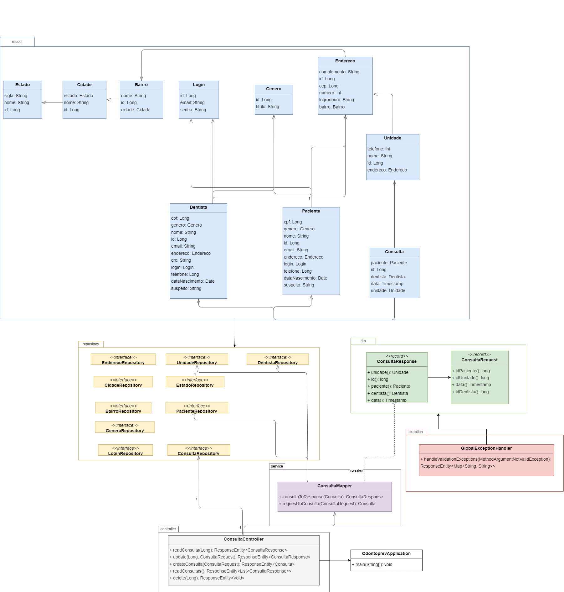
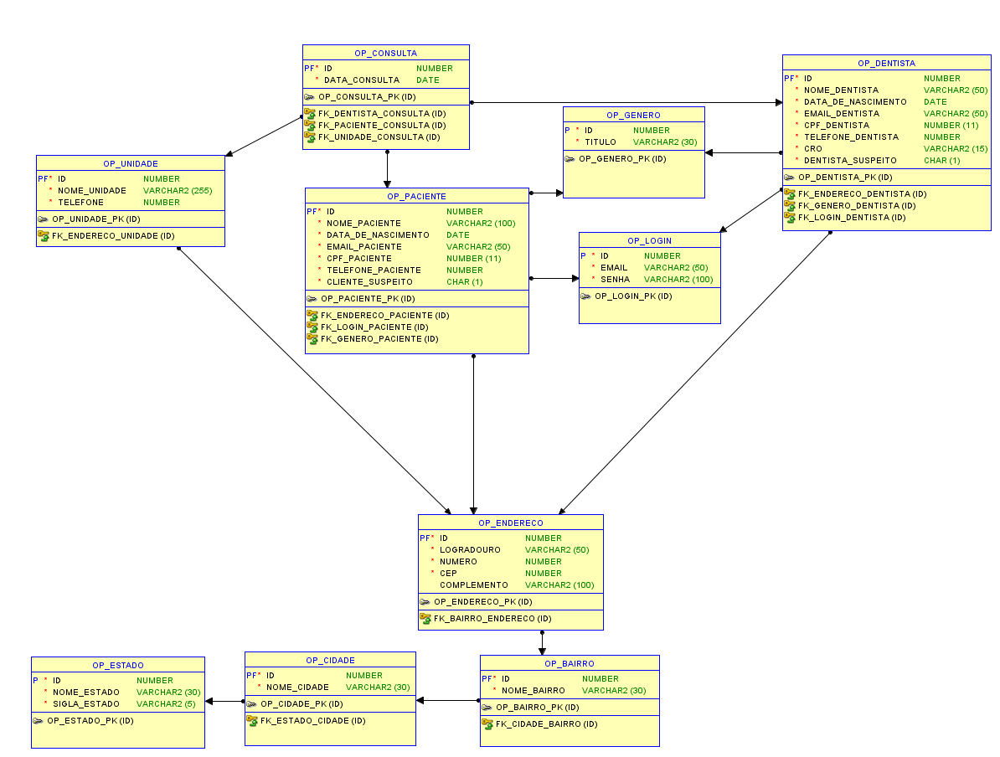
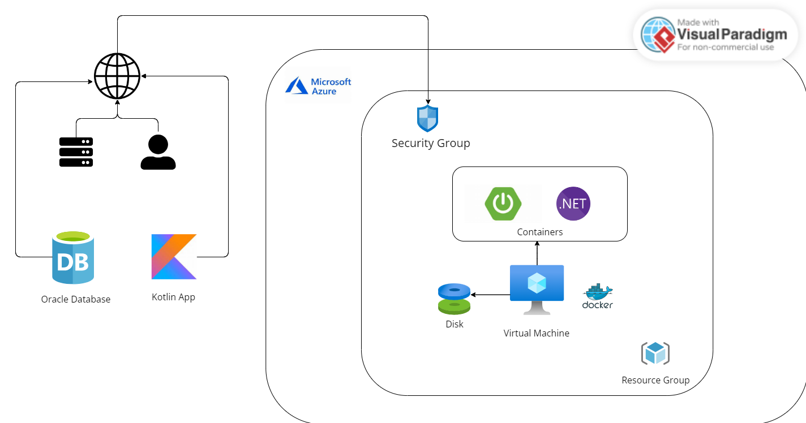

# Odontoprev - API de Consultas e Redução de Sinistros

# Cronograma do Projeto

### Equipe:
- **Celeste Mayumi Pereira Tanaka** RM552865: Responsável pela API em C# e desenvolvimento do modelo preditivo.
- **Lívia Mariana Lopes** RM552558: Responsável pela API em Java e DevOps.
- **Luana Vieira Santos da Silva** RM552994: Responsável pelo desenvolvimento do banco de dados e compliance e quality assurance do projeto.
- **Todas**: Responsáveis pelo desenvolvimento mobile.

---

## Sprint 1 
**Objetivo:** Configurações iniciais, prototipação e modelagem do banco.

- **Lívia**:
  - Configuração do ambiente para desenvolvimento da API em Java.
  - Estudo e planejamento da infraestrutura DevOps (CI/CD).
  - Início do desenvolvimento dos endpoints principais da API.
  
- **Celeste**:
  - Prototipação das telas no Figma.
  - Criação do ambiente de desenvolvimento em C#.
  - Planejamento do desenvolvimento do modelo preditivo.

- **Luana**:
  - Modelagem do banco de dados (diagrama DER).
  - Criação do ambiente de banco de dados.
  - Declaração de visão e escopo do projeto.

---

## Sprint 2 
**Objetivo:** Desenvolvimento da API e integração inicial.

- **Lívia**:
  - Desenvolvimento completo de todas as entidades da API (CRUD).
  - Realizar o deployment de máquinas virtuais.
   - Diagrama demonstrando a integração/comunicação do aplicativo com APIs/banco
de dados e sistemas externos.
  
- **Celeste**:
  - Implementação da Camada Web (ASP.NET Core) .
  - Criação da versão Beta do modelo.
  - Programação visual de 5 telas do aplicativo funcional.
- **Luana**:
  - Desenho da Arquitetura da solução.
  -  Procedures para Operações CRUD.
  - Realizar chamadas a uma API (pelo menos 3 telas fazendo requisições).

---

## Sprint 3
**Objetivo:** Testes e refinamentos.

- **Lívia**:
  - Refatoração e otimização da API (melhoria de performance, validações extras, tratamento de erros).
  - Implementação do pipeline CI/CD e automação de testes.
  
- **Celeste**:
  - Integração do modelo preditivo com a camada web (ASP.NET Core).
  - Testes do modelo preditivo com base em diferentes cenários e ajustes necessários.
  
- **Luana**:
  - Implementação final das procedures e triggers no banco de dados para garantir integridade dos dados.
  - Integração final do aplicativo mobile com a API.


---

## Sprint 4
**Objetivo:** Conclusão e entrega final.

- **Lívia**:
  - Realizar testes de integração end-to-end para garantir que a API, banco de dados e front-end estão funcionando perfeitamente juntos.
  - Deploy da API e testes finais.

- **Celeste**:
  - Finalização e validação do front-end integrado ao modelo preditivo e à API.
  - Ajustes finais no front-end com base nos testes de usabilidade.
  
- **Luana**:
  - Revisão final do fluxo do aplicativo e ajustes com base no feedback dos testes.
  - Revisão final do banco de dados.

---


##  Instruções para rodar a aplicação
1. **Pré-requisitos**:
  - Certifique-se de ter o Java 21 instalado.

2. **Rodando o Projeto**:
  - Clone o repositório:
    ```shell
    git clone https://github.com/LiviaMarianaLopes/odontoprev-api.git
    ```
  - Navegue até o diretório do projeto:
    ```shell
    cd odontoprev-api
    ```
  - Rode a aplicação diretamente pela IDE (IntelliJ ou Eclipse) 
  - A API estará disponível em `http://localhost:8080`.

## Rodando a Aplicação com Docker Compose

### Pré-requisitos
Certifique-se de ter o Docker e o Docker Compose instalados na sua máquina. Você pode verificar isso com os seguintes comandos:

```bash
docker --version
docker-compose --version
````

### Configuração do Docker Compose
O arquivo docker-compose.yml configura os containers necessários para rodar a aplicação. Certifique-se de que o seu projeto esteja configurado corretamente para rodar com Docker.

### Rodando a aplicação
Para rodar a aplicação com Docker Compose, siga as instruções abaixo:

1. Clone o repositório:

````bash
git clone https://github.com/LiviaMarianaLopes/odontoprev-api.git
````
2. Navegue até o diretório do projeto:

````bash
cd odontoprev-api
````
3. Construir e iniciar os containers: Para iniciar a aplicação com o Docker Compose, execute o seguinte comando:

````bash
docker-compose up --build
````
Esse comando irá:

-  Construir as imagens do Docker, se necessário.
-  Iniciar os containers definidos no arquivo docker-compose.yml.
4. Acessar a aplicação: 

Após a aplicação ser iniciada, ela estará disponível em `http://localhost:8080`.

5. Parar os containers:

Para parar os containers, execute:

````bash
docker-compose down
````
Isso encerrará todos os containers, mas manterá as imagens e volumes. 

Se desejar remover também as imagens e volumes, use o comando abaixo:

````bash
docker-compose down --volumes --rmi all
````
## Diagramas da Aplicação
### Diagrama de classes

### Modelagem do banco de dados

### Desenho da arquitetura 



##  Apresentação da Proposta Tecnológica
[Link para o vídeo de apresentação](https://youtu.be/Uz4d2euEe4U )

##  Documentação dos Endpoints
### Autenticação e Controle de Acesso
Os endpoints auth/register e auth/login estão disponíveis para todos os usuários e não requerem autenticação. Após o login, o usuário recebe um token JWT para autenticação nos demais endpoints, os quais exigem que o token seja enviado no cabeçalho da requisição.

### **POST** /auth/register
- **Descrição**: Registra um novo usuário.
- **Request Body**:
    ```json
    {
      "email": "usuario@exemplo.com",
      "senha": "sua_senha"
    }
    ```
- **Respostas**:
  - 200: Registro bem-sucedido.
  - 400: O email já foi cadastrado.

---

### **POST** /auth/login
- **Descrição**: Realiza login e retorna um token JWT.
- **Request Body**:
    ```json
    {
      "email": "usuario@exemplo.com",
      "senha": "sua_senha"
    }
    ```
- **Respostas**:
  - 200: Login bem-sucedido, com token JWT.
  - 400: Credenciais inválidas.

---

### **Consultas**
### **POST** /consultas
- **Descrição**: Cria uma nova consulta
- **Request Body**:
    ```json
    {
      "data": "02/11/2024 15:30",
      "idPaciente": 1,
      "idDentista": 2,
      "idUnidade": 3
    }
    ```
- **Respostas**:
  - 201: Consulta criada com sucesso
  - 400: Erros de validação

---

### **GET** /consultas
- **Descrição**: Retorna todas as consultas cadastradas
- **Respostas**:
  - 200: Lista de consultas
  - 204: Nenhuma consulta encontrada

---

### **GET** /consultas/{id}
- **Descrição**: Retorna uma consulta específica pelo ID
- **Parâmetros**:
  - `id`: ID da consulta
- **Respostas**:
  - 200: Consulta encontrada
  - 204: Nenhuma consulta encontrada

---

### **PUT** /consultas/{id}
- **Descrição**: Atualiza uma consulta existente
- **Parâmetros**:
  - `id`: ID da consulta
- **Request Body**:
    ```json
    {
      "data": "05/10/2024 10:00",
      "idPaciente": 1,
      "idDentista": 2,
      "idUnidade": 3
    }
    ```
- **Respostas**:
  - 200: Consulta atualizada com sucesso
  - 400: Consulta não encontrada ou dados inválidos

---

### **DELETE** /consultas/{id}
- **Descrição**: Exclui uma consulta pelo ID
- **Parâmetros**:
  - `id`: ID da consulta
- **Respostas**:
  - 200: Consulta excluída com sucesso
  - 400: Consulta não encontrada

##  Testes da API

Os testes da API foram criados utilizando o **Postman**. Você pode importar a coleção de testes para verificar os endpoints da aplicação.

### Instruções para rodar os testes no Postman

1. Faça o download do arquivo de testes [aqui](./Odontoprev.postman_collection_sprint2.json).
2. Abra o **Postman**.
3. No canto superior esquerdo, clique em **Import**.
4. Selecione o arquivo `.json` exportado.
5. A coleção de testes será importada para o Postman.
6. Configure a URL base da API se necessário (ex: `http://localhost:8080/consultas`).
7. Execute os testes para validar os endpoints da aplicação.

## Prints dos Testes

Abaixo estão os prints de alguns testes realizados na API utilizando o **Postman**:

### Testes de Criação de Login (POST /auth/register)
#### Sucesso


Teste mostrando a criação bem-sucedida de um novo login.

#### Erro


Teste mostrando um erro durante a tentativa de criar um novo login, devido a email já cadastrado.

### Teste de realização de login (POST /auth/login)
#### Sucesso


Teste apresentando a realização bem-sucedida de um login

### Testes de Criação de Consulta (POST /consultas)

#### Sucesso


Teste mostrando a criação bem-sucedida de uma nova consulta no sistema.

#### Erro


Teste mostrando um erro durante a tentativa de criar uma nova consulta, devido a dados inválidos.

### Testes de Atualização de Consulta (PUT /consultas/{id})

#### Sucesso


Teste mostrando a atualização bem-sucedida de uma consulta existente.

#### Erro


Teste mostrando um erro durante a tentativa de atualizar uma consulta, devido a dados inválidos ou ID inexistente.

### Testes de Listagem de Consultas (GET /consultas)

#### Sucesso


Teste mostrando a listagem de todas as consultas cadastradas.

### Testes de Consulta por ID (GET /consultas/{id})

#### Sucesso


Teste mostrando o retorno de uma consulta específica ao buscar por ID.

### Testes de Exclusão de Consulta (DELETE /consultas/{id})

#### Sucesso


Teste mostrando a exclusão bem-sucedida de uma consulta existente no sistema.


        
